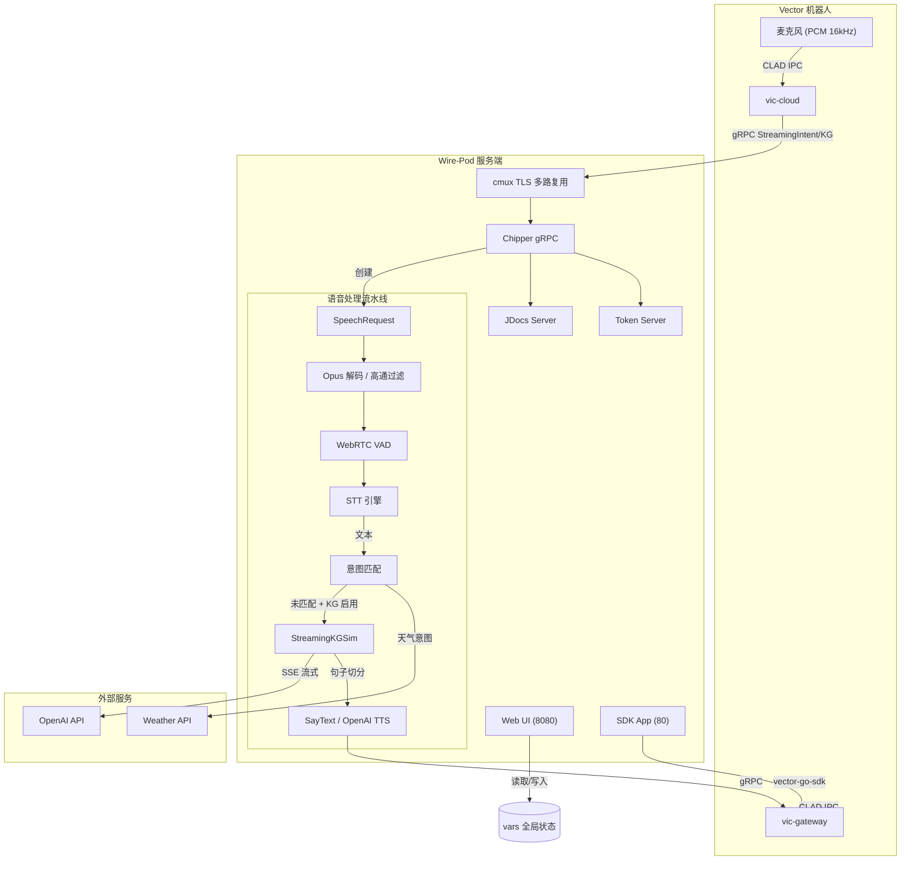

# Wire-Pod 系统架构文档

本文档从系统架构师视角，对 Wire-Pod 进行系统性拆解。阅读对象：需要长期维护本项目、或需要深入理解其工作原理的开发者。

---

## 1. 项目整体定位

### 1.1 这是什么项目

Wire-Pod 是一个**完整的机器人云后端替代实现**。它的核心使命是：让已停产的 Anki Vector 消费级机器人，在不依赖原厂商（Digital Dream Labs）付费云服务的前提下，继续完整运行语音交互、AI 问答、远程控制等全部功能。

它不是简单的"远程控制工具"，而是一个**完整的云服务平台替代方案**：
- 实现了原官方云端的 gRPC 协议接口
- 处理从机器人传来的音频流，完成语音识别、意图匹配、AI 对话、语音合成
- 管理机器人的配置、认证、固件更新通道
- 提供 Web 管理后台和 SDK 远程控制接口

### 1.2 解决的核心问题

| 问题 | Wire-Pod 的解决方案 |
|---|---|
| 官方云服务需付费订阅 | 本地免费部署，零订阅费用 |
| 官方服务器可能关闭 | 完全离线的本地处理，不依赖外网（STT 用本地引擎时） |
| 语音功能在部分地区受限 | 支持 14 种语言，可本地识别 |
| 原厂 AI 问答能力弱 | 集成现代 LLM（GPT-4o、Llama 3 等） |
| 无法自定义机器人行为 | Lua 脚本 + Go 插件 + 自定义意图系统 |

### 1.3 在机器人生态中的角色

```
┌─────────────────────────────────────────────────────────────┐
│                     用户层                                   │
│         语音命令 / SDK App / Web 后台                        │
└─────────────────────────┬───────────────────────────────────┘
                          │
┌─────────────────────────▼───────────────────────────────────┐
│                  Vector 机器人固件                           │
│     ┌──────────┐  ┌──────────┐  ┌──────────┐               │
│     │ 麦克风   │  │ AI 引擎  │  │ 动作系统 │               │
│     │ (PCM)    │  │(意图执行)│  │(动画/电机)│               │
│     └────┬─────┘  └────┬─────┘  └────▲─────┘               │
│          │             │             │                      │
│     ┌────┴─────────────┴─────────────┘                     │
│     │              vic-cloud / vic-gateway                 │
│     │         (机器人内置的云连接客户端)                    │
│     └──────────────────┬───────────────────────────────────┘
│                        │  gRPC over mTLS
└────────────────────────┼───────────────────────────────────┘
                         │
┌────────────────────────▼───────────────────────────────────┐
│                  Wire-Pod 服务端                            │
│     ┌──────────┐  ┌──────────┐  ┌──────────┐              │
│     │ Chipper  │  │  JDocs   │  │  Token   │              │
│     │ gRPC服务 │  │ 设置同步 │  │ 认证服务 │              │
│     └────┬─────┘  └──────────┘  └──────────┘              │
│          │                                                │
│     ┌────┴──────────────────────────────────────┐        │
│     │              语音 AI 流水线                 │        │
│     │  STT → 意图匹配 → LLM → TTS → 机器人 SDK   │        │
│     └───────────────────────────────────────────┘        │
│                                                          │
│     ┌──────────┐  ┌──────────┐                          │
│     │ Web UI   │  │ SDK App  │                          │
│     │(配置后台)│  │(远程控制)│                          │
│     └──────────┘  └──────────┘                          │
└──────────────────────────────────────────────────────────┘
```

### 1.4 与官方云服务的关系

**Wire-Pod 完全替代官方云服务。** 机器人固件中的 `vic-cloud` 进程会连接 Wire-Pod 的 gRPC 端口（443），就像连接官方 `chipper.api.anki.com` 一样。

关键替代点：
- 机器人通过 mTLS（工厂证书）认证，Wire-Pod 无需知道官方私钥
- `server_config.json` 被重定向到 Wire-Pod 的 IP/域名
- JDocs 读写由 Wire-Pod 本地处理，不再同步到官方云端
- Token（JWT）由 Wire-Pod 自行签发

### 1.5 系统整体工作方式

Wire-Pod 的运行时由**三个并行 HTTP/gRPC 服务**组成：

1. **主 gRPC 服务**（端口 443，TLS）：处理机器人语音流、JDocs、Token
2. **Web 配置服务**（端口 8080，HTTP）：管理后台、自定义意图、日志
3. **SDK App 服务**（端口 80，HTTP）：远程控制机器人、摄像头流、连通性检查

这三个服务在 `main()` 启动后分别运行在不同的 goroutine 中，共享内存中的配置状态（`vars.APIConfig` 等全局变量）。

### 1.6 四大核心链路

#### 音频流链路
```
机器人麦克风 (PCM 16kHz)
    → vic-cloud (Opus 编码/直接发送)
    → gRPC StreamingIntent/StreamingKG
    → Wire-Pod (Opus 解码 → 高通过滤 → VAD)
    → STT 引擎 (Vosk/Whisper 等)
    → 文本结果
```

#### AI 请求流链路
```
STT 文本
    → 意图匹配（内置 → 自定义 → 插件）
    → 若未匹配：StreamingKGSim()
    → 构造 OpenAI ChatCompletionRequest
    → 流式接收 LLM 输出
    → 按句子切分
    → Vector SDK SayText / OpenAI TTS API
    → 机器人播放语音 + 动画
```

#### 配置流链路
```
用户操作 Web UI
    → HTTP POST /api/set_kg_api 等
    → 更新 vars.APIConfig 内存结构
    → WriteConfigToDisk() → apiConfig.json
    → 部分配置（如 STT 语言）触发 ReloadVosk()
```

#### 生命周期链路
```
main() → StartFromProgramInit()
    → vars.Init()           加载配置、JDocs、意图、机器人信息
    → wp.New()              初始化语音处理器（加载 STT 模型）
    → sdkWeb.BeginServer()  启动 SDK App (端口 80)
    → wpweb.StartWebServer() 启动 Web 配置服务 (端口 8080)
    → StartChipper()        启动 gRPC 服务 (端口 443)
        → cmux 多路复用 gRPC + HTTP
```

---

## 2. 系统架构分析

### 2.1 整体架构模式

Wire-Pod 采用**"单体多服务 + 插件扩展"**模式：

- **单体**：所有核心逻辑编译在一个二进制文件中（`chipper`）
- **多服务**：内部通过 goroutine 分离出多个 HTTP/gRPC 监听端点
- **插件扩展**：通过 Lua 脚本和 Go `.so` 插件在运行时扩展意图处理能力

这不是微服务架构，而是**功能模块化、运行时单体**的设计。好处是部署简单（单个二进制），代价是各模块之间通过全局变量共享状态，存在隐式耦合。

### 2.2 模块划分与服务划分

```
┌────────────────────────────────────────────────────────────┐
│                      Wire-Pod 运行时                        │
├────────────────────────────────────────────────────────────┤
│  服务层（多端口监听）                                       │
│  ┌─────────────┐ ┌─────────────┐ ┌─────────────────────┐  │
│  │ gRPC/443    │ │ HTTP/8080   │ │ HTTP/80             │  │
│  │ Chipper服务 │ │ Web配置服务 │ │ SDK App / connCheck │  │
│  └──────┬──────┘ └──────┬──────┘ └──────────┬──────────┘  │
│         │               │                    │             │
├─────────┼───────────────┼────────────────────┼─────────────┤
│  应用层 │               │                    │             │
│  ┌──────▼──────┐ ┌──────▼──────┐    ┌───────▼────────┐   │
│  │ chipperpb   │ │ config-ws   │    │ sdkapp         │   │
│  │ 服务实现     │ │ REST API    │    │ REST API       │   │
│  └──────┬──────┘ └─────────────┘    └────────────────┘   │
│         │                                                  │
├─────────┼──────────────────────────────────────────────────┤
│  核心层 │                                                  │
│  ┌──────▼────────────────────────────────────────────┐    │
│  │ VTT / Preqs（语音请求抽象层）                      │    │
│  │ ├─ IntentRequest                                  │    │
│  │ ├─ IntentGraphRequest                             │    │
│  │ └─ KnowledgeGraphRequest                          │    │
│  └──────┬─────────────────────────────────────────────┘    │
│         │                                                  │
│  ┌──────▼──────┐  ┌──────────┐  ┌──────────────────────┐  │
│  │ speechrequest│ │   STT    │  │ ttr（Text-To-Response）│  │
│  │ 音频流状态机 │ │ 引擎接口  │  │ 意图匹配 / LLM / TTS  │  │
│  └─────────────┘  └──────────┘  └──────────────────────┘  │
│                                                             │
├─────────────────────────────────────────────────────────────┤
│  数据层（全局变量 + JSON 文件）                              │
│  ┌──────────┐ ┌──────────┐ ┌──────────┐ ┌──────────────┐  │
│  │vars.go   │ │apiConfig │ │jdocs.json│ │botSdkInfo    │  │
│  │全局状态  │ │.json     │ │机器人设置│ │.json         │  │
│  └──────────┘ └──────────┘ └──────────┘ └──────────────┘  │
└─────────────────────────────────────────────────────────────┘
```

### 2.3 通信方式

| 通信对 | 协议 | 端口 | 说明 |
|---|---|---|---|
| 机器人 ↔ Wire-Pod | gRPC over mTLS | 443 | 双向流，传输音频和意图结果 |
| 浏览器 ↔ Wire-Pod | HTTP 1.1 | 8080 | Web UI 和配置 API |
| SDK App ↔ Wire-Pod | HTTP 1.1 | 80 | 远程控制和 MJPEG 摄像头流 |
| Wire-Pod ↔ 机器人 | gRPC (vector-go-sdk) | 443 | 直接控制机器人（绕开云端） |
| Wire-Pod ↔ OpenAI | HTTPS REST | 443 | LLM 和 TTS API |
| Wire-Pod ↔ Weather API | HTTPS REST | 443 | 天气查询 |

### 2.4 数据流向与消息流向



### 2.5 AI 调用链路（核心中的核心）

```
用户说话
    │
    ▼
Vector 麦克风采集 → vic-cloud → gRPC StreamingIntentGraph
    │
    ▼
ChipperGrpc.StreamingIntentGraph (pkg/servers/chipper/intent_graph.go)
    │
    ▼
vtt.IntentGraphRequest 包装
    │
    ▼
wp.Server.ProcessIntentGraph() (pkg/wirepod/preqs/intent_graph.go)
    │
    ▼
sr.ReqToSpeechRequest() — 创建 SpeechRequest，Opus 检测/解码，初始化 VAD
    │
    ▼
STT 引擎处理（GetNextStreamChunk 循环 → VAD 判断结束 → FinalResult）
    │
    ▼
ttr.ProcessTextAll() — 意图匹配优先级：
    1. Go 插件 (PluginUtterances)
    2. 自定义意图 (customIntents.json)
    3. 内置意图 (intent-data/<lang>.json，精确匹配 → 子串匹配)
    │
    ├── 匹配成功 ──► ParamChecker() 提取参数 ──► IntentPass() ──► gRPC 返回机器人
    │
    └── 匹配失败 ──► 若 IntentGraph + Knowledge 启用：
                     │
                     ▼
              ttr.StreamingKGSim()
                     │
                     ├── 创建 openai.ChatCompletionRequest（System Prompt + 历史记录 + User 输入）
                     ├── 流式调用 CreateChatCompletionStream()
                     ├── 接收 SSE，按标点切分句子 (. ? ! ...)
                     ├── 每句提取 {{command||param}} 并执行
                     ├── Vector SDK BehaviorControl (OVERRIDE_BEHAVIORS)
                     ├── 播放 searching / tts_loop 动画
                     └── robot.Conn.SayText() / OpenAI TTS → ExternalAudioStreamPlayback
```

### 2.6 音频处理链路

```
机器人发送音频帧 (gRPC InputAudio)
    │
    ├── 首字节 0x4F ('O') → 判定为 Opus → opus.OggStream.Decode()
    │   └── 解码后 PCM 16kHz 16bit LE
    │
    └── 其他 → 判定为 PCM 原始数据
    │
    ▼
高通过滤器 (300Hz 截止，增益 5x + 1.5x)
    │
    ▼
WebRTC VAD (模式 2，320 字节/帧 @ 16kHz)
    │
    ├── Active Frame → ActiveFrames++
    ├── Inactive Frame → InactiveFrames++
    └── InactiveFrames >= 23 且 ActiveFrames > 18 → 判定语音结束
    │
    ▼
STT 引擎接收完整音频 → 输出文本
```

### 2.7 系统的"大脑"在哪里

Wire-Pod 的**真正大脑**不在单一模块，而在 **`pkg/wirepod/ttr/`** 目录下的文本响应处理体系：

- **`matchIntentSend.go`** — 决定用户说什么，路由到哪个处理分支
- **`intentparam.go`** — 从语音中提取结构化参数（地点、颜色、音量等）
- **`kgsim.go`** — 与 LLM 交互，管理 Prompt、记忆、流式响应
- **`kgsim_cmds.go`** — 将 LLM 的文本命令翻译为机器人动作

**`pkg/wirepod/preqs/server.go`** 是**调度中枢**，它连接了：
- 上层的 gRPC 服务（VTT 请求）
- 中层的音频处理（SpeechRequest）
- 下层的 STT 引擎和 TTR 响应系统

**`pkg/vars/`** 是**状态中枢**，所有运行时配置、机器人信息、JDocs、记忆都以全局变量形式存在于此。这是系统的"共享内存"。

---

## 3. 仓库目录结构分析

### 3.1 顶层目录

```
wire-pod/
├── chipper/              ← 服务端核心（最重要）
│   ├── cmd/              ← 入口点（按 STT 引擎分）
│   ├── pkg/              ← 核心库代码
│   ├── webroot/          ← Web UI 静态资源
│   ├── plugins/          ← Go 插件示例
│   ├── intent-data/      ← 内置意图 JSON
│   ├── jdocs/            ← 机器人设置存储
│   └── session-certs/    ← 机器人会话证书
├── vector-cloud/         ← 机器人端协议参考（辅助理解）
│   ├── cloud/            ← vic-cloud 入口
│   ├── gateway/          ← vic-gateway 入口
│   └── internal/         ← 协议实现
├── docker/               ← Docker 辅助脚本
├── compose.yaml          ← Docker Compose 配置
├── dockerfile            ← 多阶段构建
├── setup.sh              ← 一键安装脚本
└── update.sh             ← 更新脚本
```

### 3.2 chipper/ 详细目录（核心）

```
chipper/
├── cmd/                          ← 编译入口
│   ├── vosk/main.go              ← 默认入口：Vosk STT
│   ├── coqui/main.go             ← Coqui STT 入口
│   ├── leopard/main.go           ← Picovoice Leopard 入口
│   ├── experimental/
│   │   ├── whisper/main.go       ← OpenAI Whisper API 入口
│   │   ├── whisper.cpp/main.go   ← 本地 whisper.cpp 入口
│   │   └── houndify/main.go      ← Houndify 入口
│
├── pkg/                          ← 核心库
│   ├── initwirepod/              ← 启动初始化逻辑
│   │   └── ...                   ← StartFromProgramInit, StartChipper
│   │
│   ├── vars/                     ← 全局状态与配置（系统心脏）
│   │   ├── vars.go               ← 全局变量：机器人信息、JDocs、记忆
│   │   └── config.go             ← apiConfig.json 读写
│   │
│   ├── logger/                   ← 日志系统（UI 日志 + 控制台）
│   │
│   ├── vtt/                      ← VTT 抽象层（解耦 gRPC 与业务）
│   │   ├── intent.go             ← IntentRequest
│   │   ├── intentgraph.go        ← IntentGraphRequest
│   │   └── knowledgegraph.go     ← KnowledgeGraphRequest
│   │
│   ├── servers/                  ← gRPC 服务实现
│   │   ├── chipper/              ← ChipperGrpc 服务（语音流入口）
│   │   │   ├── server.go         ← Server 结构体 + 接口定义
│   │   │   ├── intent.go         ← StreamingIntent handler
│   │   │   ├── intent_graph.go   ← StreamingIntentGraph handler
│   │   │   ├── knowledgegraph.go ← StreamingKnowledgeGraph handler
│   │   │   └── connectioncheck.go← StreamingConnectionCheck
│   │   ├── jdocs/                ← JDocs 服务实现
│   │   └── token/                ← Token 服务实现
│   │
│   ├── wirepod/                  ← 语音处理核心
│   │   ├── preqs/                ← 请求处理中枢
│   │   │   ├── server.go         ← New() 初始化，STT handler 注册
│   │   │   ├── intent.go         ← ProcessIntent (legacy)
│   │   │   ├── intent_graph.go   ← ProcessIntentGraph (modern)
│   │   │   └── knowledgegraph.go ← ProcessKnowledgeGraph
│   │   ├── speechrequest/        ← 音频流状态机
│   │   │   └── speechrequest.go  ← SpeechRequest + Opus/VAD/过滤
│   │   ├── stt/                  ← STT 引擎实现
│   │   │   ├── vosk/             ← Vosk 本地识别
│   │   │   ├── coqui/            ← Coqui 本地识别
│   │   │   ├── leopard/          ← Picovoice Leopard
│   │   │   ├── whisper/          ← OpenAI Whisper API
│   │   │   ├── whisper.cpp/      ← 本地 whisper.cpp
│   │   │   └── houndify/         ← Houndify 云识别
│   │   ├── ttr/                  ← 文本响应系统（大脑）
│   │   │   ├── matchIntentSend.go← 意图匹配与发送
│   │   │   ├── intentparam.go    ← 参数提取（天气、颜色、音量等）
│   │   │   ├── kgsim.go          ← LLM 流式对话核心
│   │   │   ├── kgsim_cmds.go     ← LLM 命令解析与执行
│   │   │   ├── kgsim_interrupt.go← 触摸/唤醒词中断
│   │   │   ├── weather.go        ← 天气 API 调用
│   │   │   ├── plugins.go        ← Go 插件加载
│   │   │   └── words2num.go      ← 数字词转数值
│   │   ├── sdkapp/               ← SDK 远程控制服务
│   │   │   ├── server.go         ← HTTP handler + 机器人操控
│   │   │   └── jdocspinger.go    ← JDocs 保活
│   │   ├── config-ws/            ← Web 配置服务
│   │   │   └── webserver.go      ← HTTP API handler
│   │   ├── setup/                ← 机器人 onboarding
│   │   │   ├── certs.go          ← 证书生成
│   │   │   ├── ble.go            ← BLE 配对 API
│   │   │   └── ssh.go            ← SSH 部署 API
│   │   └── localization/         ← 多语言与模型下载
│   │
│   └── scripting/                ← Lua 脚本引擎
│       ├── scripting.go          ← Lua 运行时 + 函数绑定
│       ├── bcontrol.go           ← 行为控制 Lua API
│       └── display.go            ─ 屏幕显示 Lua API
│
├── webroot/                      ← Web UI 静态文件
│   ├── index.html                ← 主仪表盘
│   ├── setup.html                ← 服务器设置
│   ├── initial.html              ← 首次安装向导
│   ├── js/                       ← 前端脚本
│   └── sdkapp/                   ← SDK App 前端
│
├── plugins/                      ← Go 插件示例
│   ├── whatdate/                 ← 示例：返回日期
│   └── sdkTest/                  ← 示例：SDK 调用
│
├── intent-data/                  ← 内置意图定义
│   ├── en-US.json                ← 英语意图
│   └── ...                       ← 其他 13 种语言
│
└── epod/                         ← Escape Pod 兼容文件
```

### 3.3 vector-cloud/ 目录（协议参考）

```
vector-cloud/
├── cloud/main.go                 ← vic-cloud 入口（机器人云连接客户端）
├── gateway/main.go               ← vic-gateway 入口（SDK 服务端）
└── internal/
    ├── voice/                    ← 语音流处理
    │   ├── process.go            ← 语音事件循环（Hotword/Audio/AudioDone）
    │   └── stream/               ← gRPC 流连接与缓冲
    ├── token/                    ← JWT 认证管理
    ├── jdocs/                    ← JDocs 客户端
    ├── clad/                     ← CLAD 协议消息定义
    ├── proto/                    ← protobuf 生成代码
    └── robot/                    ← 机器人身份与证书
```

> **注意**：`vector-cloud/` 目录中的代码**不直接参与 Wire-Pod 服务端运行**，它是机器人固件中运行的客户端代码。维护 Wire-Pod 时，阅读这些代码是为了理解机器人如何连接、如何编码音频、如何解析响应。

### 3.4 目录协作关系

```
cmd/<engine>/main.go
    │
    └── 调用 initwirepod.StartFromProgramInit(stt.Init, stt.STT, stt.Name)
        │
        ├── vars.Init()               ← 加载所有 JSON 配置到内存
        ├── wp.New(...)               ← 初始化 STT 引擎 + 加载意图 + 加载插件
        ├── sdkWeb.BeginServer()      ← goroutine: 启动 SDK App (端口 80)
        └── wpweb.StartWebServer()    ← 阻塞: 启动 Web 配置服务 (端口 8080)
            └── 若 setup 完成，另起 goroutine: StartChipper()
                └── 启动 gRPC + cmux (端口 443)
```

---

## 4. 核心模块拆解

### 4.1 机器人通信模块

**位置**：`pkg/servers/chipper/`, `pkg/servers/jdocs/`, `pkg/servers/token/`

**职责**：实现机器人期望的 gRPC 服务接口，接收音频流、处理 JDocs 读写、签发 JWT Token。

**输入输出**：
- 输入：`pb.ChipperGrpc_StreamingIntentServer` 等 gRPC 流
- 输出：`pb.IntentResponse`, `pb.IntentGraphResponse`, `pb.KnowledgeGraphResponse`

**生命周期**：
1. `StartChipper()` 加载 TLS 证书
2. `cmux.New(tlsListener)` 创建多路复用监听器
3. `grpc.NewServer()` 注册 `ChipperGrpc`, `JdocsServer`, `TokenServer`
4. 每个机器人连接创建独立的 gRPC stream，在各自 goroutine 中处理

**状态管理**：无持久连接状态，每次语音请求都是新的 stream。

**并发模型**：每个 gRPC stream 对应一个独立的请求处理 goroutine。STT 引擎内部可能需要互斥锁（如 Vosk 的 recognizer pool）。

### 4.2 音频处理模块

**位置**：`pkg/wirepod/speechrequest/speechrequest.go`

**职责**：将从机器人接收的原始字节流转化为可供 STT 引擎使用的标准 PCM 数据，并检测语音结束。

**核心数据结构**：
```go
type SpeechRequest struct {
    Device          string
    Session         string
    FirstReq        []byte          // 首帧音频（用于 Opus 检测）
    Stream          interface{}     // gRPC stream（3 种类型之一）
    IsKG            bool            // 是否知识图谱请求
    IsIG            bool            // 是否意图图请求
    MicData         []byte          // 原始接收数据
    DecodedMicData  []byte          // Opus 解码后 PCM
    FilteredMicData []byte          // 高通过滤后 PCM
    PrevLen         int             // 上次读取位置
    InactiveFrames  int             // VAD 非活跃帧计数
    ActiveFrames    int             // VAD 活跃帧计数
    VADInst         *webrtcvad.VAD  // VAD 实例
    LastAudioChunk  []byte          // 最后一块音频（用于 VAD）
    IsOpus          bool            // 是否为 Opus 流
    OpusStream      *opus.OggStream // Opus 解码器
}
```

**生命周期**：
1. `ReqToSpeechRequest(req)` — 从 gRPC 首包创建，检测 Opus/PCM，初始化 VAD
2. `GetNextStreamChunk()` 循环 — 持续接收音频，解码，过滤
3. `DetectEndOfSpeech()` — 每帧判断语音是否结束
4. 结束后交给 STT 引擎

**风险点**：
- `Stream` 字段是 `interface{}`，需要类型断言为 3 种 gRPC stream 之一，编译期无类型安全
- 高通过滤器每次调用都进行浮点运算，未使用查找表优化
- Opus 解码失败时只打印日志，不终止流，可能导致后续数据全部错误

### 4.3 STT/TTS 模块

**STT 位置**：`pkg/wirepod/stt/*`

**统一接口**：
```go
func Init() error
func STT(req sr.SpeechRequest) (string, error)
```

**各引擎对比**：

| 引擎 | 运行位置 | 并发模型 | 特殊依赖 |
|---|---|---|---|
| Vosk | 本地 | recognizer pool (mutex) | CGO, `libvosk` |
| whisper.cpp | 本地 | 单请求独占 | CGO, `ggml-*.bin` 模型 |
| Coqui | 本地 | 每请求新建 stream | CGO, `model.tflite` |
| Leopard | 本地 | 固定实例池 (全局 BotNum) | `PICOVOICE_APIKEY` |
| Whisper API | 云端 | HTTP 请求 | `OPENAI_KEY` |
| Houndify | 云端 | 流式 HTTP | `HOUNDIFY_STT_ID/KEY` |

**TTS 位置**：`pkg/wirepod/ttr/kgsim.go`, `pkg/wirepod/ttr/bcontrol.go`

**两种方式**：
1. **Vector 内置 TTS**：`robot.Conn.SayText(ctx, &vectorpb.SayTextRequest{UseVectorVoice: true})`
2. **OpenAI TTS**：调用 `tts-1` API 获取 PCM，通过 `ExternalAudioStreamPlayback` 发送到机器人

### 4.4 AI 对话模块

**位置**：`pkg/wirepod/ttr/kgsim.go`

**职责**：将未匹配的语音请求转化为与 LLM 的流式对话，并把 LLM 的文本回复切分为句子，驱动机器人逐句说出。

**核心流程**：
```go
StreamingKGSim(req, esn, transcribedText, isKG)
    ├── 查找机器人信息 (botSdkInfo.json)
    ├── vector.New() 创建 SDK 连接
    ├── BControl() 请求行为控制权 (OVERRIDE_BEHAVIORS)
    ├── 若 isKG：播放 searching 动画循环
    ├── CreateAIReq() 构造 ChatCompletionRequest
    │   ├── System Prompt（用户可自定义）
    │   ├── 最多 16 轮历史记录
    │   └── 当前 User 消息
    ├── CreateChatCompletionStream() 流式请求
    ├── goroutine：读取 SSE stream，按标点切分句子
    └── 主循环：
        ├── 等待 behavior control granted
        ├── 播放 get-in 动画
        ├── 启动 tts_loop 动画循环
        ├── 逐句：GetActionsFromString() → PerformActions()
        │   ├── sayText 或 OpenAI TTS
        │   ├── playAnimationWI / playAnimation
        │   └── getImage（摄像头回传）
        └── 结束：释放 behavior control
```

**并发模型**：极其复杂，涉及 5+ 个 goroutine + 4+ 个 channel：
- LLM 读取 goroutine
- 动画循环 goroutine
- Behavior control 监听 goroutine
- 中断监听 goroutine（触摸/唤醒词）
- 主 TTS 循环 goroutine

**状态管理**：主要通过局部 channel 传递信号，无显式状态机。这是代码中最难理解和最容易出并发问题的地方。

### 4.5 Prompt 管理模块

**位置**：`pkg/wirepod/ttr/kgsim.go` 中的 `CreatePrompt()` 和 `CreateAIReq()`

**Prompt 结构**：
```
System: "You are a helpful, animated robot called Vector. Keep the response concise yet informative."
        + [用户自定义 prompt]
        + "No special characters... No lists. No formatting."
        + [若 CommandsEnable: 嵌入命令参考文档]

User: <transcribedText>
```

**上下文管理**：`vars.RememberedChats` 按 ESN 保存最近 16 条消息（8 轮对话）。

**设计问题**：
- Prompt 是硬编码字符串拼接，没有模板引擎
- 没有版本化管理，修改 Prompt 可能影响所有用户场景
- 特殊字符过滤 (`removeSpecialCharacters`) 用大量 `strings.ReplaceAll` 链式调用，效率低且难以维护

### 4.6 Web 后台模块

**位置**：`pkg/wirepod/config-ws/webserver.go`

**职责**：提供 HTTP REST API 供前端管理配置。

**API 分组**：
- **意图管理**：`add_custom_intent`, `edit_custom_intent`, `remove_custom_intent`, `get_custom_intents_json`
- **天气配置**：`set_weather_api`, `get_weather_api`
- **LLM 配置**：`set_kg_api`, `get_kg_api`
- **STT 配置**：`set_stt_info`, `get_stt_info`, `get_download_status`
- **系统**：`get_logs`, `get_debug_logs`, `get_config`, `generate_certs`, `delete_chats`
- **OTA**：`get_ota`（archive.org 代理）

**状态管理**：直接修改全局 `vars.APIConfig`，然后调用 `vars.WriteConfigToDisk()` 写入 JSON。

**并发风险**：HTTP handler 和 gRPC handler 同时读写 `vars.APIConfig`，**没有显式同步机制**。虽然 Go 的 JSON 写操作不是原子性的，但项目中依赖"配置修改不频繁"这一假设。

### 4.7 配置系统模块

**位置**：`pkg/vars/config.go`, `pkg/vars/vars.go`

**配置层级**：
1. **编译时**：`STT_SERVICE` 决定编译哪个 `cmd/<engine>/main.go`
2. **环境变量**：首次启动时，`CreateConfigFromEnv()` 从环境变量生成 `apiConfig.json`
3. **JSON 文件**：`apiConfig.json` 是持久化真相源
4. **内存**：`vars.APIConfig` 是运行时唯一访问点
5. **运行时修改**：Web UI API 直接改内存 + 写回 JSON

**配置项结构**：
```go
type apiConfig struct {
    Weather   struct { Enable, Provider, Key, Unit }
    Knowledge struct { Enable, Provider, Key, ID, Model, IntentGraph, 
                        RobotName, OpenAIPrompt, OpenAIVoice, 
                        SaveChat, CommandsEnable, Endpoint, TopP, Temp }
    STT       struct { Service, Language }
    Server    struct { EPConfig, Port }
    HasReadFromEnv, PastInitialSetup bool
}
```

**动态更新**：仅 STT 语言切换会触发 `ReloadVosk()` 重新加载模型。其他配置（如 LLM key）立即生效，因为每次请求都读取 `vars.APIConfig`。

### 4.8 插件/扩展机制

**Go 原生插件**：`pkg/wirepod/ttr/plugins.go`

- 运行时扫描 `./plugins/*.so`
- 要求导出符号：`Utterances *[]string`, `Name *string`, `Action func(...)`
- 匹配方式：子串包含（utterance 为 `"*"` 时匹配所有）
- 限制：Go plugin 对 Go 版本敏感，编译器和运行时版本必须一致

**Lua 脚本**：`pkg/scripting/scripting.go`

- 使用 `yuin/gopher-lua` + `vadv/gopher-lua-libs`
- 为每个脚本创建独立 `LState`
- 绑定函数：`assumeBehaviorControl`, `sayText`, `playAnimation`, `moveWheels`, `postHTTPRequest` 等
- 自定义意图通过 `luascript` 字段关联

**扩展性评价**：
- Lua 扩展性很好：无需重启、无需编译、沙箱运行
- Go 插件扩展性差：编译依赖严格、平台相关（Linux/macOS）、无法热更新
- 意图系统扩展性中等：JSON 格式简单，但参数提取逻辑硬编码在 `intentparam.go` 中

---

## 5. 核心调用链分析

### 5.1 服务启动流程

```go
// cmd/vosk/main.go
func main() {
    initwirepod.StartFromProgramInit(stt.Init, stt.STT, stt.Name)
}

// pkg/initwirepod/start.go (推断)
func StartFromProgramInit(sttInitFunc, sttHandlerFunc, voiceProcessorName) {
    // 1. 初始化全局变量
    vars.Init()
    
    // 2. 创建语音处理器
    wp.New(sttInitFunc, sttHandlerFunc, voiceProcessorName)
    
    // 3. 启动 SDK App (goroutine)
    go sdkWeb.BeginServer()
    
    // 4. 注册 /api-chipper/ HTTP handler
    http.HandleFunc("/api-chipper/", ...)
    
    // 5. 若未完成初始设置，先阻塞在 setup web server
    if !vars.APIConfig.PastInitialSetup {
        wpweb.StartWebServer()  // 阻塞
    }
    
    // 6. 启动 Chipper gRPC (goroutine)
    go StartChipper()
    
    // 7. 阻塞在 Web 配置服务
    wpweb.StartWebServer()
}

// StartChipper()
func StartChipper() {
    tlsConfig := 加载 cert.crt / cert.key
    listener := tls.Listen("tcp", ":"+port, tlsConfig)
    
    // cmux 多路复用
    m := cmux.New(listener)
    grpcL := m.Match(cmux.HTTP2())
    httpL := m.Match(cmux.HTTP1Fast())
    
    // gRPC 服务器
    grpcS := grpc.NewServer(grpc.Creds(...))
    chipperServer, _ := chipper.New(
        chipper.WithIntentProcessor(wpServer),
        chipper.WithKnowledgeGraphProcessor(wpServer),
        chipper.WithIntentGraphProcessor(wpServer),
    )
    pb.RegisterChipperGrpcServer(grpcS, chipperServer)
    jdocspb.RegisterJdocsServer(grpcS, jdocsServer)
    tokenpb.RegisterTokenServer(grpcS, tokenServer)
    
    go grpcS.Serve(grpcL)
    go http.Serve(httpL, nil)  // 健康检查 /ok
    m.Serve()
}
```

**关键状态变化**：
1. `VarsInited = false` → `vars.Init()` → `VarsInited = true`
2. `PastInitialSetup = false` → 用户完成 Web 向导 → `PastInitialSetup = true`
3. gRPC 服务从 `Stopped` → `Running`，此时机器人可以开始连接

### 5.2 机器人连接流程

```
机器人开机
    │
    ▼
vic-cloud 读取 /factory/cloud/AnkiRobotDeviceCert.pem
    │
    ▼
vic-cloud 读取 /anki/data/assets/cozmo_resources/config/server_config.json
    │   （Wire-Pod setup 时将此文件指向 Wire-Pod 的 IP/域名）
    ▼
vic-cloud 通过 mTLS 连接 Wire-Pod:443
    │
    ▼
Chipper gRPC 接收连接
    │
    ▼
JDocs 读写 / Token 认证
    │
    ▼
Wire-Pod 的 jdocs/server.go 在读取 vic.AppTokens 时：
    ├── 匹配机器人 IP
    ├── 写入 GUID 和 hash
    ├── 生成 session cert 到 session-certs/<ESN>
    └── 更新 sdk_config.ini
    │
    ▼
机器人完成认证，进入就绪状态
```

### 5.3 一次完整语音对话流程

这是 Wire-Pod 最核心的调用链，必须逐帧理解：

**Phase 1: 用户说话 → 音频到达服务端**

```go
// 1. 机器人检测到唤醒词（"Hey Vector" 或按钮）
//    vic-cloud 内部：mic 进程 → CLAD Hotword 消息 → voice.Process()

// 2. vic-cloud 创建 stream.Streamer，打开 gRPC stream
//    conn := chipper.NewConn(config.Env.Chipper)
//    stream := conn.NewIntentGraphStream(ctx, sessionUUID, firmwareVersion, ...)

// 3. 音频通过 gRPC 上传到 Wire-Pod
//    机器人侧：PCM → Opus 编码（可选）→ gRPC Send(InputAudio)
//    服务端侧：
func (s *Server) StreamingIntentGraph(stream pb.ChipperGrpc_StreamingIntentGraphServer) error {
    // 接收首包
    firstReq, _ := stream.Recv()
    req := &vtt.IntentGraphRequest{
        Time:       time.Now(),
        Stream:     stream,
        Device:     firstReq.DeviceId,
        Session:    firstReq.Session,
        LangString: firstReq.LanguageCode,
        FirstReq:   firstReq,
    }
    // 调用处理中枢
    return wpServer.ProcessIntentGraph(req)
}
```

**Phase 2: 音频解码与语音活动检测**

```go
func ProcessIntentGraph(req *vtt.IntentGraphRequest) {
    speechReq := sr.ReqToSpeechRequest(req)
    // 内部：
    // - 检测首字节 0x4F → IsOpus = true
    // - opus.OggStream.Decode(firstReq) → PCM
    // - highPassFilter(decoded) → FilteredMicData
    // - webrtcvad.New(); vad.SetMode(2)
}

// 循环接收音频，直到语音结束
var transcribedText string
for {
    chunk, _ := speechReq.GetNextStreamChunk()
    // 内部：stream.Recv() → OpusDecode → highPassFilter
    
    speechDone, doProcess := speechReq.DetectEndOfSpeech()
    // 内部：SplitVAD(chunk) → vad.Process(16000, chunk)
    // 条件：InactiveFrames >= 23 && ActiveFrames > 18
    
    if speechDone && doProcess {
        // 语音结束，进行识别
        if !isSti {
            transcribedText, _ = sttHandler(speechReq)
        }
        break
    }
}
```

**Phase 3: 意图匹配**

```go
func ProcessTextAll(req, transcribedText, intentList, isOpus) bool {
    // 1. 检查 Go 插件
    if pluginFunctionHandler(...) { return true }
    
    // 2. 检查自定义意图
    if customIntentHandler(...) { return true }
    
    // 3. 检查内置意图
    for _, intent := range intentList {
        // 精确匹配
        if voiceText == keyphrase { match = true }
        // 子串匹配（除非 RequireExactMatch）
        if strings.Contains(voiceText, keyphrase) { match = true }
    }
    
    if match {
        ParamChecker(req, intent, speechText, botSerial)
        // 提取参数后：
        IntentPass(req, intent, speechText, intentParams, isParam)
        return true
    }
    return false
}
```

**Phase 4: LLM  fallback（若意图未匹配且 KG 启用）**

```go
if !successMatched && vars.APIConfig.Knowledge.Enable {
    if vars.APIConfig.Knowledge.IntentGraph {
        ttr.StreamingKGSim(req, esn, transcribedText, false)
    }
}

// StreamingKGSim 内部：
// 见 4.4 节的详细流程
```

**Phase 5: 响应返回机器人**

```go
// 意图匹配成功：
IntentPass() → stream.Send(&pb.IntentGraphResponse{...})

// LLM 成功：
// 通过 Vector SDK 直接控制：
robot.Conn.SayText(ctx, &vectorpb.SayTextRequest{Text: "...", UseVectorVoice: true})
// 同时发送 IntentGraphResponse（让机器人知道处理已完成）
```

**核心函数调用顺序总结**：

```
main()
  → StartFromProgramInit()
    → vars.Init()
    → wp.New()                    [初始化 STT]
    → StartChipper()              [启动 gRPC]
      → cmux.Serve()              [监听连接]
        → StreamingIntentGraph()  [收到机器人语音流]
          → ProcessIntentGraph()
            → sr.ReqToSpeechRequest()  [音频初始化]
            → GetNextStreamChunk() 循环 [收音频]
              → DetectEndOfSpeech()   [VAD 检测]
            → sttHandler()          [语音识别]
            → ttr.ProcessTextAll()  [意图匹配]
              → ParamChecker()      [参数提取]
              → IntentPass()        [返回意图]
            → 或 ttr.StreamingKGSim() [LLM 对话]
              → CreateAIReq()       [构造 Prompt]
              → CreateChatCompletionStream() [请求 LLM]
              → PerformActions()    [执行动作+语音]
```

---

## 6. 关键文件与关键方法

### 6.1 项目入口

| 文件 | 角色 | 风险点 |
|---|---|---|
| `cmd/vosk/main.go` | 默认编译入口 | 仅一行代码，过于简单 |
| `pkg/initwirepod/start.go` | 启动编排中枢 | 包含大量平台特判（Android/iOS/macOS/Linux） |

### 6.2 网络入口

| 文件 | 角色 | 说明 |
|---|---|---|
| `pkg/servers/chipper/server.go` | gRPC 服务定义 | 定义 `intentProcessor` 等 3 个接口 |
| `pkg/servers/chipper/intent_graph.go` | 现代语音流入口 | 所有新固件使用此接口 |
| `pkg/servers/chipper/knowledgegraph.go` | 知识图谱流入口 | 处理 "I have a question" 类请求 |
| `pkg/wirepod/config-ws/webserver.go` | Web API 入口 | 所有 /api/* 路由在此分发 |
| `pkg/wirepod/sdkapp/server.go` | SDK 远程控制入口 | 所有 /api-sdk/* 和 /cam-stream |

### 6.3 AI 入口

| 文件 | 角色 | 上下游 |
|---|---|---|
| `pkg/wirepod/ttr/kgsim.go` | LLM 对话核心 | 上：ProcessIntentGraph；下：vector-go-sdk |
| `pkg/wirepod/ttr/kgsim_cmds.go` | AI 命令执行 | 上：kgsim.go 的句子输出；下：AnimationQueues + SDK |
| `pkg/wirepod/ttr/matchIntentSend.go` | 意图匹配路由 | 上：STT 文本；下：内置/自定义/插件/LLM |

### 6.4 音频入口

| 文件 | 角色 | 说明 |
|---|---|---|
| `pkg/wirepod/speechrequest/speechrequest.go` | 音频流状态机 | 全系统唯一处理音频编解码和 VAD 的文件 |
| `pkg/wirepod/stt/vosk/Vosk.go` | 默认 STT 实现 | 使用 recognizer pool 管理并发 |

### 6.5 配置入口

| 文件 | 角色 | 风险点 |
|---|---|---|
| `pkg/vars/config.go` | 配置读写 | 全局变量 `APIConfig` 无并发保护 |
| `pkg/vars/vars.go` | 全局状态 | 包含 400+ 行全局变量定义，任何包都可读写 |

### 6.6 最复杂的方法

**`StreamingKGSim()`** (`pkg/wirepod/ttr/kgsim.go`，约 300 行)：
- 涉及 5+ goroutine、4+ channel、LLM 流式读取、机器人动画队列、行为控制、触摸中断
- 没有显式状态机，所有状态通过 channel 和局部布尔变量传递
- **这是整个项目中最难维护的函数**，任何修改都可能引入并发 bug

**`ParamChecker()`** (`pkg/wirepod/ttr/intentparam.go`，约 700 行)：
- 巨大的 switch-case，硬编码处理每种意图的参数提取
- 包含天气 API 调用、数字词转换、颜色映射等杂糅逻辑
- **意图参数系统的核心，但可扩展性极差**

---

## 7. 技术栈与依赖分析

### 7.1 核心技术选择理由

| 技术 | 用途 | 选择理由 |
|---|---|---|
| **Go** | 主语言 | 编译为单二进制、并发友好、CGO 可绑定 C 语音库 |
| **gRPC** | 机器人通信 | 官方云端使用 gRPC，必须协议兼容 |
| **cmux** | 端口多路复用 | 让 443 端口同时服务 gRPC 和 HTTP/1.1 |
| **Vosk** | 本地 STT | 离线运行、支持多种语言、模型体积小 |
| **OpenAI API** | LLM + TTS | 最成熟的流式 Chat API，生态兼容性好 |
| **vector-go-sdk** | 机器人控制 | 社区维护的 Vector SDK，支持行为控制、动画、语音 |
| **Gopher-Lua** | 脚本扩展 | 轻量、可嵌入 Go、无需编译 |

### 7.2 关键依赖风险

| 依赖 | 风险等级 | 说明 |
|---|---|---|
| `github.com/digital-dream-labs/opus-go` | **高** | DDL 的私有 fork，不再维护。若需更新 Opus 逻辑，可能需自行维护 |
| `github.com/kercre123/vosk-api/go` | **中** | Vosk 的 Go 绑定依赖 CGO 和 libvosk，跨平台编译复杂 |
| `github.com/kercre123/whisper.cpp/bindings/go` | **中** | whisper.cpp 绑定同样依赖 CGO，且模型文件大 |
| `github.com/fforchino/vector-go-sdk` | **中** | 社区 fork，若原作者停止维护，需社区接手 |
| `github.com/yuin/gopher-lua` | **低** | 成熟稳定，但 Lua 脚本无类型安全 |
| `github.com/soheilhy/cmux` | **低** | 功能简单稳定，但项目活跃度低 |

### 7.3 无数据库设计

Wire-Pod 不使用任何数据库（SQL 或 NoSQL），所有状态以 JSON 文件形式存储。这是设计上的有意选择：
- **优点**：零依赖、备份简单、人类可读
- **缺点**：无事务保证、并发写入可能损坏文件、查询效率低

> 当前实现中，`WriteConfigToDisk()` 和 `WriteJdocs()` 都不是原子操作，若进程在写入时崩溃，可能导致 JSON 文件截断。

---

## 8. 工程设计分析

### 8.1 设计优点

**1. 协议兼容性设计**

Wire-Pod 最大的工程成就是**完全复刻了官方云端的 gRPC 协议**。这意味着：
- 无需修改机器人固件
- 生产机器人和开发版机器人都可直接使用
- 兼容未来固件版本（只要协议不变）

**2. 音频流水线解耦**

`SpeechRequest` 将音频编解码、VAD、过滤等细节封装，为上层的 STT 引擎提供统一接口。新增 STT 引擎只需实现 `func STT(sr.SpeechRequest) (string, error)`。

**3. STT 引擎的可插拔性**

通过 `cmd/<engine>/main.go` 在编译时选择引擎，运行时通过反射判断 handler 签名（STT vs STI）。虽然不够动态，但避免了运行时加载复杂 CGO 库的问题。

**4. 多服务分离**

gRPC（443）、Web UI（8080）、SDK App（80）三个服务分离：
- Web UI 崩溃不影响机器人语音功能
- SDK App 端口冲突不会导致整个系统退出

**5. Lua 脚本扩展**

相比 Go 插件，Lua 脚本真正实现了"热更新"和"沙箱化"，是本项目扩展性最好的设计之一。

### 8.2 设计缺点与技术债

**1. 全局变量泛滥**

`pkg/vars/vars.go` 中定义了数十个包级全局变量（`var BotJdocs`, `var BotInfo`, `var APIConfig`, `var RememberedChats`...）。

- **问题**：任何包都可以隐式修改状态，调用链难以追踪
- **风险**：HTTP handler 和 gRPC handler 并发读写同一变量，无互斥保护
- **重构建议**：将全局状态封装为 `type State struct`，通过依赖注入传递

**2. `interface{}` 滥用**

`SpeechRequest.Stream` 是 `interface{}`，需要在运行时类型断言为 3 种 gRPC stream：`ChipperGrpc_StreamingIntentServer`、`ChipperGrpc_StreamingIntentGraphServer`、`ChipperGrpc_StreamingKnowledgeGraphServer`。

- **问题**：编译期无类型检查，新增 stream 类型时容易遗漏
- **重构建议**：使用泛型或定义统一接口

**3. `StreamingKGSim()` 的并发混沌**

该函数内部启动了多个 goroutine，通过 channel 和闭包变量协作，但没有文档说明各 goroutine 的职责和时序关系。

- **问题**：极难调试，死锁风险高，测试覆盖困难
- **重构建议**：引入显式状态机（如 `type KGState int` + `state machine`），将 goroutine 通信模式文档化

**4. 意图参数提取硬编码**

`intentparam.go` 用 700 行 switch-case 处理各种意图的参数，新增意图需要修改此文件并重新编译。

- **问题**：违背开闭原则
- **重构建议**：将参数提取规则配置化（如 JSON schema），或使用小型 DSL

**5. 特殊字符过滤性能差**

`removeSpecialCharacters()` 使用 20+ 次 `strings.ReplaceAll` 链式调用，每次调用都创建新字符串。

- **问题**：时间复杂度 O(n × m)，频繁 GC
- **重构建议**：使用 `strings.Builder` + 单次遍历，或正则表达式预编译

**6. 配置文件非原子写入**

`WriteConfigToDisk()` 直接 `os.WriteFile(ApiConfigPath, writeBytes, 0644)`，没有临时文件 + rename 的原子写入模式。

- **问题**：进程崩溃时可能留下截断的 JSON
- **修复建议**：写入 `apiConfig.json.tmp` → `os.Rename()` → `apiConfig.json`

**7. `removeEmojis()` 正则灾难**

该函数的正则表达式重复了同一个字符类 40+ 次，形成极长的模式串。

- **问题**：正则编译开销大、可读性差
- **重构建议**：拆分为明确的 Unicode range 检查

### 8.3 历史遗留问题

- **`StreamingIntent`**（`intent.go`）： legacy 接口，仅兼容 1.6 及以下固件。现代固件都使用 `StreamingIntentGraph`。
- **EPConfig 模式**：Escape Pod 是 DDL 早期产品，相关证书逻辑（`ep.crt`/`ep.key`）对非 Escape Pod 用户造成困惑。
- **Houndify 集成**：作为早期知识图谱提供商，代码分散在 STT 和 KG 两个模块中，与 OpenAI 流式架构格格不入。
- **Vosk grammar 优化**：`VOSK_WITH_GRAMMER`（拼写错误）环境变量控制的语法优化功能，代码路径复杂且仅在 Vosk 中可用。

---

## 9. 新人接手指南

### 9.1 推荐阅读顺序

建议按以下顺序建立认知，**不要一开始就读具体算法**：

1. **先理解协议**：阅读 `vector-cloud/internal/voice/process.go` 和 `stream/context.go`，理解机器人如何发送音频
2. **再理解服务端入口**：阅读 `pkg/servers/chipper/intent_graph.go`，理解 gRPC 请求如何进入处理流程
3. **理解音频流水线**：阅读 `pkg/wirepod/speechrequest/speechrequest.go`，理解音频如何被解码和检测
4. **理解意图匹配**：阅读 `pkg/wirepod/ttr/matchIntentSend.go`，理解语音文本如何变成机器人动作
5. **理解 AI 对话**：阅读 `pkg/wirepod/ttr/kgsim.go`，理解 LLM 如何接入
6. **最后看配置和 Web**：阅读 `pkg/vars/config.go` 和 `pkg/wirepod/config-ws/webserver.go`

### 9.2 必须优先理解的模块

| 优先级 | 模块 | 原因 |
|---|---|---|
| P0 | `pkg/wirepod/speechrequest` | 所有语音请求的基石 |
| P0 | `pkg/wirepod/preqs` | 请求调度的十字路口 |
| P0 | `pkg/vars` | 全局状态，改这里影响全系统 |
| P1 | `pkg/wirepod/ttr/kgsim.go` | AI 功能的核心，最复杂 |
| P1 | `pkg/servers/chipper` | 网络入口，协议兼容性关键 |
| P2 | `pkg/wirepod/config-ws` | Web 后台，功能迭代频繁 |
| P2 | `pkg/wirepod/sdkapp` | 远程控制，用户直接接触 |
| P3 | `pkg/scripting` | 扩展机制，按需深入 |

### 9.3 快速跑通项目

```bash
# 1. 克隆
git clone https://github.com/kercre123/wire-pod.git
cd wire-pod

# 2. 运行 setup（下载模型、生成证书）
./setup.sh

# 3. 启动
cd chipper
STT_SERVICE=vosk STT_LANGUAGE=en-US ./chipper

# 4. 打开浏览器访问 http://localhost:8080 完成初始配置
```

### 9.4 调试各链路

**调试机器人通信**：
- 查看日志中 `Loaded bot info file, known bots: [...]` 确认机器人已认证
- 若未出现，检查机器人 `server_config.json` 中的 IP 是否正确
- 使用 `openssl s_client -connect <wirepod-ip>:443` 验证 TLS 证书

**调试音频链路**：
- 开启 `DEBUG_LOGGING=true`
- 查找 `(Bot <ESN>) Stream type: OPUS/PCM` 确认音频格式
- 查找 `(Bot <ESN>) End of speech detected.` 确认 VAD 正常工作
- 临时将 `speechrequest.go` 中的 `debugWriteFile = true`，分析 `/tmp/wirepodtest.ogg`

**调试 AI 请求**：
- 查找 `Using gpt-4o-mini` 或对应模型名，确认 LLM 配置生效
- 若出现 `GPT-4 model cannot be accessed`，说明 API key 余额不足或权限不够
- 查找 `LLM response for <ESN>:` 查看完整 LLM 输出

### 9.5 最容易踩坑的地方

1. **STT 服务编译时确定**：如果你想换 STT 引擎，必须重新编译整个二进制（`go build ./cmd/<engine>`），而不是改配置。运行时唯一能切换的是 Vosk/whisper.cpp 的语言模型。
2. **全局变量并发**：修改 `vars.go` 中的任何变量前，先思考是否有并发读写。当前代码几乎没有锁保护。
3. **`interface{}` 类型断言失败**：修改 gRPC 相关代码时，如果 `SpeechRequest.Stream` 的类型断言失败，会 panic 或返回 `invalid type` 错误。
4. **CGO 交叉编译**：Vosk 和 whisper.cpp 依赖 CGO，在 macOS 上编译 Linux 二进制、或 ARM 交叉编译时，需要正确设置 `CC`/`CXX`/`CGO_LDFLAGS`。
5. **Go 插件版本锁定**：编译 `.so` 插件时，Go 版本必须与编译主程序的完全一致，否则加载时报错。
6. **证书与 IP 绑定**：证书生成时绑定到当前外网 IP，若服务器 IP 变化（如 DHCP 重新分配），所有机器人都会断开，需重新生成证书并重新部署 `server_config.json`。

### 9.6 最难理解的地方

- **`StreamingKGSim()` 的 goroutine 协作**：建议用 IDE 的 goroutine 视图或手动画出 channel 交互图
- **JDocs 版本控制**：DocVersion/FmtVersion 的乐观并发控制逻辑，需要结合 `pkg/servers/jdocs/server.go` 和机器人固件的行为理解
- **CLAD 协议**：`vector-cloud/internal/clad/` 中的消息定义，是理解机器人和服务端如何交换非 gRPC 数据的钥匙

### 9.7 最容易改崩的地方

- **`pkg/vars/vars.go`**：随便加一个全局变量可能影响所有包
- **`pkg/wirepod/ttr/kgsim.go`**：并发逻辑极脆弱，加一行 `time.Sleep` 都可能破坏时序
- **`pkg/wirepod/speechrequest/speechrequest.go`**：音频处理是实时流水线，任何额外的内存分配或计算都可能增加延迟，导致 VAD 判断失常
- **Protobuf 定义**：`pkg/servers/chipper/server.go` 中的接口若变更，必须同步更新 `vector-cloud` 中的调用方（如果是你自己维护固件）

---

## 10. 项目总结

### 10.1 项目真正核心

Wire-Pod 的核心不是某一个算法或模型，而是**"协议兼容性 + 本地语音 AI 流水线"**这一组合。它让一台消费级机器人摆脱了对已关闭/收费云服务的依赖，同时通过现代 LLM 赋予了机器人远超原厂设计的智能水平。

### 10.2 系统的大脑

- **调度大脑**：`pkg/wirepod/preqs/server.go` — 决定每个语音请求走哪条处理路径
- **AI 大脑**：`pkg/wirepod/ttr/kgsim.go` — 与 LLM 交互，生成自然语言响应
- **动作大脑**：`pkg/wirepod/ttr/kgsim_cmds.go` + `intentparam.go` — 将文本转化为机器人可执行的结构化命令
- **记忆中枢**：`pkg/vars/vars.go` — 保存所有运行时状态和持久化数据

### 10.3 最复杂部分

**`StreamingKGSim()` 函数**是整个项目的复杂度峰值。它同时处理了：
- LLM SSE 流式读取
- 句子级 TTS 调度
- 机器人行为控制请求/释放
- 动画队列管理
- 触摸/唤醒中断
- 多 goroutine 协作

这是新人接手时最需要花时间理解的部分，也是未来重构的首要目标。

### 10.4 最关键设计思想

1. **兼容即生存**：不修改机器人固件，完全通过协议模拟接入，这是项目能够存在的根本原因
2. **编译时引擎选择**：STT 引擎在编译时确定，简化了运行时依赖管理，但牺牲了灵活性
3. **全局状态共享**：用全局变量替代依赖注入，降低了代码复杂度，但增加了维护风险
4. **JSON 即数据库**：用文件替代数据库，降低了部署门槛，但牺牲了数据一致性

### 10.5 决定系统复杂度的模块

| 模块 | 复杂度贡献 |
|---|---|
| `pkg/wirepod/ttr/kgsim.go` | 并发 goroutine + channel 管理 |
| `pkg/wirepod/ttr/intentparam.go` | 700 行硬编码参数提取 |
| `pkg/wirepod/speechrequest/speechrequest.go` | 实时音频流水线的状态管理 |
| `pkg/servers/jdocs/server.go` | JDocs 版本控制和机器人认证逻辑 |
| `vector-cloud/internal/voice/stream/context.go` | 机器人端的流缓冲和重连逻辑 |

### 10.6 如果重构，优先改哪里

**第一优先级：状态管理**
- 将 `pkg/vars/` 的全局变量封装为带锁的结构体，或引入小型嵌入式数据库（如 SQLite/BoltDB）
- 配置文件写入改为原子操作

**第二优先级：AI 对话模块**
- 将 `StreamingKGSim()` 拆分为显式状态机：Waiting → Thinking → Speaking → Animating → Idle
- 每个状态独立为方法，channel 通信改为状态转换事件

**第三优先级：意图系统**
- 将 `intentparam.go` 的参数提取规则外置为 JSON/YAML 配置
- 引入小型规则引擎（如 expr）处理参数逻辑

**第四优先级：音频流水线**
- 将 `SpeechRequest.Stream interface{}` 改为泛型或统一接口
- 考虑引入 ring buffer 减少音频处理中的内存分配

### 10.7 最需要补文档的地方

1. **并发模型**：`StreamingKGSim()` 和各 goroutine 的交互时序图（当前为零文档）
2. **JDocs 版本协议**：DocVersion/FmtVersion 的冲突解决策略
3. **STT 引擎接入指南**：如何为 Wire-Pod 添加新的语音识别引擎
4. **LLM Prompt 工程指南**：系统 Prompt、Commands Prompt、上下文管理的完整说明
5. **证书与认证流程**：从工厂证书到 session cert 的完整信任链

---

*本文档基于 Wire-Pod 实际代码结构编写，适用于长期维护和新人上手。若代码发生重大变更，请同步更新本文档。*
