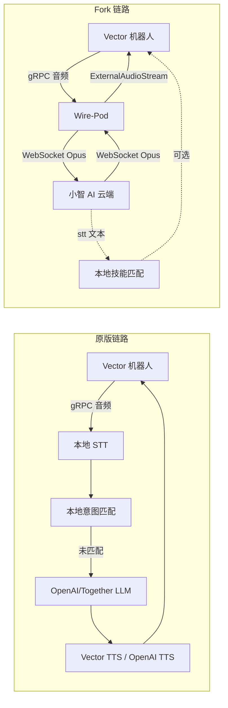

# Wire-Pod-Chinese Fork 深度差异分析报告

> 上游项目：`kercre123/wire-pod`
> Fork 项目：`hurst/wire-pod`（wire-pod-chinese）
> 分析日期：2026-05-26
> 分析范围：全部代码差异、架构差异、行为差异

---

## 1. 项目改造概览

### 1.1 这个 Fork 做了什么

**一言概括：该 Fork 将 Wire-Pod 的"本地/国际版 AI 语音流水线"彻底替换为"中国小智 AI（Xiaozhi）云端语音流水线"，并围绕中文场景做了配套改造。**

原版 Wire-Pod 的核心 AI 链路是：
```
机器人语音 → 本地 STT (Vosk/Whisper) → 本地意图匹配 → 国际 LLM (OpenAI/Together) → Vector 内置 TTS/OpenAI TTS
```

Fork 后的核心 AI 链路变为：
```
机器人语音 → 小智 AI 云端 (WebSocket) → 小智云负责 STT+LLM+TTS → 云端 Opus 音频流回传 → Vector 外放播放
```

与此同时，Fork 还新增了：
- **Kaldi/Sherpa-Onnx 中文离线 STT 引擎**（备用/实验性）
- **ROS 机器人操作系统桥接**（Python SDK）
- **OpenCV 摄像头工具**
- **SDK App 触摸控制按钮**

### 1.2 整体目标

| 目标 | 实现方式 |
|---|---|
| 让 Vector 机器人说中文 | 接入小智 AI 云端（全中文对话） |
| 让 Vector 听懂中文 | 小智云 STT + 本地 Vosk 中文模型 + Kaldi 中文模型 |
| 降低中国用户使用门槛 | 无需 OpenAI 账号、无需国际网络、无需配置复杂 LLM |
| 扩展机器人控制能力 | ROS 桥接、IoT 命令（底盘移动、音量调节） |
| 优化中文意图识别 | 修改本地化字符串，适配中文语法习惯 |

### 1.3 与原版最大的区别

**原版是"自主可控的本地 AI 平台"，Fork 是"小智 AI 云端的硬件接入终端"。**

原版的价值在于：**不依赖任何第三方云**，所有 AI 处理可在本地完成（Vosk + whisper.cpp + 可选 OpenAI）。

Fork 的价值在于：**接入成熟的中文语音云**，用户开箱即用，但代价是将核心 AI 大脑交给了第三方云服务（tenclass.net/xiaozhi）。

---

## 2. 功能变更总览

| 类型 | 改动 | 影响 |
|---|---|---|
| **新增** | 小智 AI 云端接入模块 (`xiaozhi_ai.go`, 991 行) | **彻底替换 AI 流水线**，所有语音交互走小智云 |
| **新增** | Kaldi/Sherpa-Onnx 中文 STT 引擎 | 提供中文离线语音识别能力（实验性） |
| **新增** | ROS 桥接 (`python_sdk/ros_move.py`) | Vector 可接入 ROS 生态，接收 `/cmd_vel` 等话题 |
| **新增** | OpenCV 摄像头工具 (`python_sdk/camera.py`) | 独立运行摄像头流查看和 FPS 统计 |
| **新增** | SDK App 触摸方向键按钮 | 手机/平板可直接触摸控制机器人移动 |
| **新增** | `gorilla/websocket` 依赖 | 支撑小智 AI WebSocket 连接 |
| **新增** | `k2-fsa/sherpa-onnx-go` 依赖 | 支撑 Kaldi 中文语音识别 |
| **修改** | `ProcessIntentGraph` 核心调度逻辑 | 原流水线被重命名为 `_old_code`，新逻辑直调小智云 |
| **修改** | SDK App `say_text` 端点 | 不再使用 Vector 内置 TTS，改为调用小智 AI 朗读 |
| **修改** | MJPEG 摄像头流处理 | 移除 JPEG 编解码，直接透传原始流，增加 FPS 统计 |
| **修改** | 中文本地化字符串表 | 优化天气、名字、方向等中文意图匹配关键词 |
| **修改** | 机器人表情 GIF 资源 | 全部替换为新版素材 |
| **删除（实质）** | 原版 `StreamingKGSim` LLM 对话能力 | 保留代码但不再执行，OpenAI/Together 配置失效 |
| **删除（实质）** | 原版 VAD→STT→意图匹配→LLM Fallback 全链路 | 仅保留意图匹配作为"技能"层，ASR/LLM/TTS 外包给小智 |
| **风险修改** | `camStreamHandler` 移除 `Context.Done()` 监听 | 客户端断开后 goroutine 可能泄漏，摄像头流不清理 |

---

## 3. 核心模块改动

### 3.1 新增模块：小智 AI 接入层 (`xiaozhi_ai.go`)

**文件**：`chipper/pkg/wirepod/preqs/xiaozhi_ai.go`（991 行，全项目最大新增文件）

**职责**：作为 Vector 机器人与小智 AI 云端之间的双向音频/命令网关。

**架构**：
```
┌─────────────────────────────────────────────────────────────┐
│                    xiaozhi_ai.go                             │
│                                                              │
│  ┌─────────────┐    WebSocket    ┌──────────────────────┐   │
│  │  OTA 注册   │ ───────────────►│  api.tenclass.net    │   │
│  │ (MAC+UUID)  │                 │  /xiaozhi/ota/       │   │
│  └─────────────┘                 └──────────┬───────────┘   │
│                                             │               │
│                              返回 WS URL + Token            │
│                                             │               │
│  ┌─────────────┐    WebSocket    ┌──────────▼───────────┐   │
│  │  WS 连接    │ ◄──────────────►│   小智 AI 云端        │   │
│  │ (音频上行)  │   (Opus 双向)   │   (STT/LLM/TTS)      │   │
│  │ (TTS 下行)  │                 │                      │   │
│  └─────────────┘                 └──────────────────────┘   │
│         │                                                    │
│         ▼                                                    │
│  ┌────────────────────────────────────────────┐             │
│  │  Vector ExternalAudioStreamPlayback        │             │
│  │  (播放小智云返回的 TTS 音频)                │             │
│  └────────────────────────────────────────────┘             │
└─────────────────────────────────────────────────────────────┘
```

**核心流程**：
1. `XiaozhiInit()` — 初始化 Opus 编解码器、建立 WebSocket、启动监听/重连 goroutine
2. `XiaozhiProcessAudio(intentReq)` — 被 `ProcessIntentGraph` 调用，替代原流水线
3. 录音阶段：`GetNextStreamChunk()` → PCM → `opusEncode()` → WebSocket BinaryMessage
4. 等待阶段：轮询 50×100ms 等待小智云返回 `stt` 文本结果
5. 播放阶段：收到 WebSocket BinaryMessage (Opus TTS) → `opusDecode()` → `ExternalAudioStreamPlayback`
6. 控制阶段：收到 `iot` 命令 → 执行 SetVolume / DoMove

**关键状态变量（全局）**：
```go
var opusDecoder, opusEncoder       // Opus 编解码器（全局单例）
var audioClient                     // Vector 音频流 gRPC 客户端
var isTTSPLAYING                    // TTS 播放状态标志
var wsConn                          // WebSocket 连接（全局）
var wsReconnecting                  // 重连标志
var isRecording                     // 录音状态标志
var asrStr                          // 最后一次 ASR 结果（全局）
var CurRobot                        // 当前操作的机器人对象（全局）
```

**调用链**：
```
main() → StartFromProgramInit() → wp.New() → XiaozhiInit()
                                      │
            机器人唤醒 → StreamingIntentGraph → ProcessIntentGraph
                                      │
                              XiaozhiProcessAudio(req)
                                      │
                    ┌─────────────────┼─────────────────┐
                    ▼                 ▼                 ▼
            [录音上传]          [等待 STT]          [接收 TTS]
            GetNextStreamChunk   轮询 asrStr      opusDecode + 播放
            → opusEncode         → 返回文本       → ExternalAudioStreamPlayback
            → WS Send
```

**为什么这样设计？**

小智 AI 是一个面向中国 IoT 设备的"语音助手云"，提供了完整的 ASR→NLP→TTS 闭环。对于没有国际网络、不想配置 OpenAI、希望开箱即用的中国用户，这大幅降低了使用门槛。但同时也意味着：
- 所有语音数据必须上传到 tenclass.net
- AI 回复质量完全取决于小智云
- 无法自定义 Prompt、无法使用 GPT-4 等高级模型

---

### 3.2 新增模块：Kaldi 中文 STT (`stt/kaldi/`)

**文件**：
- `chipper/cmd/experimental/kaldi/main.go`
- `chipper/pkg/wirepod/stt/kaldi/Kaldi.go`（301 行）

**技术栈**：`k2-fsa/sherpa-onnx-go` + Paraformer 中文模型

**模型配置**：
```go
mode_path := "sherpa-onnx-paraformer-zh-2024-03-09"
paraformer_name := filepath.Join(python_chdir, mode_path, "model.int8.onnx")
tokens_name := filepath.Join(python_chdir, mode_path, "tokens.txt")
```

**特点**：
- 使用 `int8` 量化模型，体积小、速度快
- 模型路径通过环境变量 `PYTHON_CHDIR` 控制
- 目前标记为 `experimental`，说明是备用/实验性质

**为什么新增？**

原版 Wire-Pod 的 Vosk 中文模型虽然存在，但识别准确率对中国用户可能不够理想。Paraformer 是阿里达摩院开源的中文语音识别模型，在中文场景下准确率显著高于 Vosk。这为不想用小智云、希望离线运行的用户提供了替代方案。

**注意**：该引擎编译入口存在，但结合 `ProcessIntentGraph` 的改动来看，**实际运行时默认不走这个引擎**——因为语音流被小智云接管了。它更像是一个备用选项或未来扩展点。

---

### 3.3 新增模块：Python SDK 工具集 (`python_sdk/`)

**文件**：
- `python_sdk/camera.py`（49 行）
- `python_sdk/ros_move.py`（184 行）

**`camera.py`**：
- 基于 `anki_vector` Python SDK
- 使用 OpenCV (`cv2`) 实时显示摄像头画面
- 计算并打印 FPS
- 独立运行脚本，不依赖 Wire-Pod 服务端

**`ros_move.py`**：
- 基于 `anki_vector` + `rospy`
- 订阅 ROS 话题：
  - `/cmd_vel` (`Twist`) → 转换为左右轮速度，驱动机器人移动
  - `/btn1`~`/btn4` (`Bool`) → 控制头部和抬升臂上下
- 发布 ROS 话题：
  - `/image_raw/compressed` (`CompressedImage`) → 摄像头 JPEG 流
- 支持 ROS Melodic (Python 2.7) 和 Noetic (Python 3)

**为什么新增？**

原版 Wire-Pod 只能通过 Web UI 或 gRPC 控制机器人。添加 ROS 桥接后，Vector 可以融入标准的机器人研发生态：
- 可用 ROS Navigation 做路径规划
- 可用 RViz 查看摄像头画面
- 可用标准 ROS Teleop 遥控

这对中国的机器人开发者、高校实验室来说非常有价值，因为 ROS 是中国机器人领域的事实标准。

---

### 3.4 核心调度模块重写 (`preqs/intent_graph.go`)

**修改前**：
```go
func (s *Server) ProcessIntentGraph(req *vtt.IntentGraphRequest) {
    speechReq := sr.ReqToSpeechRequest(req)
    transcribedText, _ := sttHandler(speechReq)        // 本地 STT
    successMatched := ttr.ProcessTextAll(req, transcribedText, ...)  // 本地意图匹配
    if !successMatched {
        if vars.APIConfig.Knowledge.Enable {            // 本地/OpenAI LLM
            ttr.StreamingKGSim(req, req.Device, transcribedText, false)
        }
    }
}
```

**修改后**：
```go
func (s *Server) ProcessIntentGraph(req *vtt.IntentGraphRequest) {
    asrStr, err := XiaozhiProcessAudio(req)            // 小智云 ASR→LLM→TTS 全包
    if err != nil { ... }
    successMatched := ttr.ProcessTextAll(req, asrStr, vars.IntentList, true)
    if successMatched { return nil, nil }               // 如果本地技能匹配成功，直接返回
    ttr.IntentPass(req, "intent_system_noaudio", "", map[string]string{}, false)
}
```

**关键行为变化**：
1. 原来的本地 STT（Vosk/Whisper）**被跳过**
2. 原来的 OpenAI/Together LLM **被跳过**
3. 原来的 Vector 内置 TTS / OpenAI TTS **被跳过**
4. 所有语音处理外包给小智云
5. 仅保留**本地意图匹配**作为"技能层"——如果小智云 ASR 出的文本恰好匹配本地定义的技能，则执行该技能

**旧代码被保留但废弃**：原 `ProcessIntentGraph` 被重命名为 `ProcessIntentGraph_old_code`，但没有任何地方调用它。这是一种"保留备份但不维护"的做法。

---

### 3.5 SDK App 模块改造 (`sdkapp/server.go` + `robot.go`)

**`robot.go`**：
- `getRobot()` 改名为 `GotRobot()`。这看起来像是为了避免命名冲突或单纯的命名偏好，但影响所有调用方。

**`server.go`** 的 `say_text` 端点：

**修改前**：
```go
robot.Conn.SayText(ctx, &vectorpb.SayTextRequest{
    DurationScalar: 1,
    UseVectorVoice: true,
    Text: r.FormValue("text"),
})
```

**修改后**：
```go
err := preqs.SendDetect(robot, r.FormValue("text"))
```

**行为变化**：用户在 SDK App 中输入文字让机器人说话，不再使用 Vector 自带的英语 TTS，而是把文字发给小智 AI，让小智云生成中文语音并通过 Vector 播放出来。

**`camStreamHandler`**：

**修改前**：接收摄像头原始数据 → `image.Decode` → `jpeg.Encode(multi, img, Quality: 50)` → MJPEG 流

**修改后**：接收摄像头原始数据 → **直接透传** `jpegBytes` → MJPEG 流

**优化点**：Vector 固件返回的已经是 JPEG 格式，原版却先解码再重新编码，浪费 CPU。Fork 直接透传，降低了服务端 CPU 占用。

**风险点**：
1. 移除了 `r.Context().Done()` 监听。当客户端关闭浏览器标签页时，`camStreamHandler` 的 goroutine 不会收到退出信号，会持续读取摄像头流，造成 goroutine 泄漏。
2. 注释中写道 `"应该直接可以把jpegBytes写入http协议"` —— 实际上 MJPEG 协议要求在每帧前写入 boundary header，`multi.Write(jpegBytes)` 之前确实写了 header，所以格式是对的。但缺少客户端断开时的清理逻辑。

---

### 3.6 本地化模块微调 (`localization/localization.go`)

**改动**：调整部分中文关键词，使其更符合中文口语习惯。

| 常量 | 原值 | 修改后 | 目的 |
|---|---|---|---|
| `STR_WEATHER_IN` | `" 的 "`（含空格） | `"的"`（去空格） | 避免空格导致匹配失败 |
| `STR_NAME_IS` | `"到"` | `"是"` | 中文说"名字**是**XXX"更自然 |
| `STR_NAME_IS2` | `"的"` | `"叫"` | 中文说"**叫**XXX"更自然 |
| `STR_NAME_IS3` | `"名字"` | `"姓"` | 扩展匹配范围 |

**为什么改？**

原版的 `zh-CN.json` 意图数据和本地化字符串是由非中文母语者或早期贡献者编写的，部分关键词不符合中国用户的自然说话习惯。这些微调能提高语音识别后的意图匹配率。

---

## 4. AI 能力改动

### 4.1 模型支持变化

| 能力 | 原版 | Fork |
|---|---|---|
| **STT** | Vosk / Whisper / Coqui / Leopard / Houndify | **小智云 ASR**（主）+ Kaldi Paraformer（备用） |
| **LLM** | OpenAI GPT-4o / Together Llama 3 / Custom | **小智云 LLM**（黑盒，模型未知） |
| **TTS** | Vector 内置 TTS / OpenAI TTS | **小智云 TTS**（返回 Opus 音频流） |

**核心变化**：从"多引擎可选、本地为主、云端为辅"变为"单一云端全包"。

### 4.2 Prompt 变化

**原版**：
- System Prompt 可自定义（`openai_prompt` 字段）
- 默认："You are a helpful, animated robot called Vector..."
- 支持 Commands Enable 让 LLM 控制动画

**Fork**：
- Prompt 完全由小智云内部管理，用户不可见、不可修改
- 不再使用 `CreatePrompt()` / `CreateAIReq()` 等函数（这些代码保留在 `kgsim.go` 中但不再被调用）
- 不再支持 `{{playAnimationWI||happy}}` 等 LLM 嵌入命令

**影响**：用户失去了对 AI "人设" 和 "能力边界" 的控制权。无法让 Vector 变成"严谨的学术助手"或"幽默的脱口秀演员"——它的性格完全由小智云决定。

### 4.3 Memory（对话记忆）

**原版**：支持保存最近 16 条消息（`vars.RememberedChats`），按 ESN 隔离。

**Fork**：记忆管理完全由小智云负责。`RememberedChats` 和相关代码保留但不再使用。

### 4.4 Function Calling / Tool Calling / Agent

**原版**：通过文本嵌入 `{{command||param}}` 实现轻量级命令调用（动画、摄像头、新语音请求）。

**Fork**：
- 小智云返回 `iot` 类型的 JSON 命令
- 目前仅支持 `SetVolume` 和 `DoMove`
- `DoMove` 在代码中被注释掉：
  ```go
  //sendRobotMoveCommand(action)
  //对话结束一段时间段内，多意图效果很不好，暂时不使用本功能
  ```

**Agent 能力**：小智云本身可能具备多轮对话和工具调用能力，但 Wire-Pod 端只透传了极少量的 IoT 命令，大部分小智 Agent 能力未被利用。

### 4.5 AI 请求链路变化



**关键差异**：
- 原版是"分布式处理"（STT 本地、LLM 云端/本地、TTS 本地）
- Fork 是"云端全包"（STT/LLM/TTS 全在小智云）
- Fork 的 Wire-Pod 更像"音频网关 + 技能插件宿主"

---

## 5. 中文化改动

### 5.1 语音层面

| 项目 | 原版 | Fork |
|---|---|---|
| 中文 STT 模型 | Vosk `zh-CN`（通用） | 小智云 ASR（优化中文口语）+ Kaldi Paraformer（阿里中文模型） |
| 中文 TTS | 不支持（Vector 内置只支持英语） | 小智云 TTS（自然中文语音） |
| 唤醒词 | "Hey Vector" / 按钮 | **"你好小智"**（通过小智云） |
| 语音交互语言 | 依赖用户配置 | 默认全中文 |

### 5.2 Prompt 层面

原版的 Prompt 是英文，Fork 不再使用本地 Prompt。小智云内部的 Prompt 对中国文化、中文网络用语、国内时事可能更了解，但用户无法查看和修改。

### 5.3 UI 层面

**客观事实**：Fork 的 Web UI **并没有进行中文化翻译**，所有按钮、标签、提示仍然是英文。

但新增了：
- `zh-CN` 语言选项（下拉框存在）
- 部分日志输出增加了中文注释（如 `"机器人连接成功 Successfully got jdocs from"`）

### 5.4 国内服务适配

| 服务 | 原版 | Fork |
|---|---|---|
| AI 后端 | OpenAI/Together（国际） | 小智 AI（国内） |
| OTA 更新 | archive.org（国际） | 未改变 |
| 天气 API | OpenWeatherMap / WeatherAPI（国际） | 未改变 |
| 语音识别 | Vosk（俄罗斯开源） | 小智云 / Paraformer（阿里，国内） |

### 5.5 网络环境适配

原版的所有云端服务（OpenAI、archive.org、Vosk 模型下载源）对中国用户都存在网络访问问题。Fork 通过接入小智云，解决了最核心的"AI 对话"环节的网络问题。

**但注意**：天气 API、GitHub 版本检查、Vosk 模型下载（若使用本地模式）仍然依赖国际网络。

---

## 6. 配置变更

### 6.1 go.mod 依赖变化

```diff
+ github.com/gorilla/websocket v1.5.3       // 小智 AI WebSocket 连接
+ github.com/k2-fsa/sherpa-onnx-go/sherpa_onnx  // Kaldi 中文 STT
+ github.com/spf13/pflag                      // Kaldi CLI 参数解析
- github.com/sashabaranov/go-openai v1.41.2
+ github.com/sashabaranov/go-openai v1.27.1   // 降级（保留但未使用）
- github.com/alphacep/vosk-api/go v0.3.50     // indirect 删除
- github.com/kercre123/vosk-api v1.0.1        // indirect 删除
```

**go-openai 降级分析**：从 v1.41.2 降级到 v1.27.1。降级原因不明，可能是为了兼容 `sherpa-onnx-go` 或其他依赖的 transitive 约束。但由于 OpenAI 功能实际已被废弃，这个降级没有功能性影响。

### 6.2 新增环境变量/配置

| 配置项 | 来源 | 说明 |
|---|---|---|
| `PYTHON_CHDIR` | 环境变量 | Kaldi 模型根目录路径 |
| 小智 OTA URL | 硬编码 | `https://api.tenclass.net/xiaozhi/ota/` |
| 小智 WS Protocol | 硬编码 | `WS_PROTOCOL_V1 = "1"` |
| Kaldi 模型路径 | 硬编码 | `sherpa-onnx-paraformer-zh-2024-03-09` |

### 6.3 失效的原版配置

以下原版配置在 Fork 中**虽然仍存在于代码和 UI 中，但已失效**：

| 配置 | 失效原因 |
|---|---|
| `Knowledge.Provider = openai` | `ProcessIntentGraph` 不再调用 `StreamingKGSim` |
| `Knowledge.Provider = together` | 同上 |
| `Knowledge.Provider = custom` | 同上 |
| `Knowledge.OpenAIPrompt` | 不再使用本地 Prompt |
| `Knowledge.Model` | 小智云决定模型 |
| `Knowledge.CommandsEnable` | 小智云返回 `iot` 命令而非文本嵌入命令 |
| `Knowledge.SaveChat` | 小智云管理记忆 |
| `STT.Service = vosk` | 语音流被小智云接管，本地 STT 不执行 |
| `STT.Language` | 小智云自动识别语言 |

**坑点**：用户如果在 Web UI 中配置了 OpenAI Key、选择了 LLM 模型、设置了自定义 Prompt，这些配置会被静默忽略，系统不会给出任何提示。这会造成极大的用户困惑。

---

## 7. Web UI 改动

### 7.1 SDK App 控制页面 (`sdkapp/control.html` + `control.js`)

**新增内容**：在原有键盘遥控（WASD）基础上，增加了**触摸按钮**。

```html
<!-- 新增 HTML -->
<div class="direction-pad">
  <button id="btnForward" class="dir-btn" 
          onmousedown="startKey('w')" onmouseup="stopKey('w')" 
          ontouchstart="startKey('w')" ontouchend="stopKey('w')">Forward</button>
  <!-- 同理：Backward, Left, Right -->
</div>
<div> <!-- Head Up/Down -->
  <button id="btnHeadUp">Up</button>
  <button id="btnHeadDown">Down</button>
</div>
<div> <!-- Lift Up/Down -->
  <button id="btnLiftUp">Up</button>
  <button id="btnLiftDown">Down</button>
</div>
```

**为什么新增？**

原版 SDK App 只能通过键盘（WASD + R/F/T/G）控制机器人，在手机/平板上无法操作。新增触摸按钮后，用户可以直接在手机上点击控制，更符合中国用户的移动端使用习惯。

### 7.2 机器人表情资源 (`webroot/assets/*.gif`)

所有 14 个表情 GIF 文件被替换。原版是 Vector 的官方表情动画，Fork 替换为新版素材（具体内容需查看二进制差异，推测是更可爱的版本或中国用户社区制作的版本）。

### 7.3 设置页面

Web UI 的设置页面**没有新增配置项**来切换"小智云模式"和"原版模式"。这意味着：
- 用户无法选择使用小智云还是 OpenAI
- 用户无法关闭小智云恢复原版行为
- 这是一个**强制替换**，而非可选功能

---

## 8. 核心代码改动

### 8.1 最关键的文件：`xiaozhi_ai.go`

**改动规模**：991 行新增代码，全项目最大单文件。

**核心逻辑**：
- 通过 MAC 地址和 UUID 在小智云注册设备
- 建立 WebSocket 长连接，维护心跳/重连
- 双向音频流：上行 PCM→Opus→WS，下行 WS→Opus→PCM→Vector
- 处理小智云的 `stt` / `llm` / `tts` / `iot` 消息类型

**最危险的代码**：

1. **全局状态混乱**：
   ```go
   var wsConn *websocket.Conn
   var audioClient vectorpb.ExternalInterface_ExternalAudioStreamPlaybackClient
   var isTTSPLAYING bool
   var CurRobot *vector.Vector
   ```
   这些全局变量在多机器人场景下会互相覆盖。如果两台 Vector 同时唤醒，`CurRobot` 和 `audioClient` 会被后唤醒的那台覆盖，导致音频流混乱。

2. **STT 结果忙等**：
   ```go
   for i := 0; i < 50; i++ {
       if asrStr != "" { break }
       time.Sleep(100 * time.Millisecond)
   }
   ```
   硬编码最多等待 5 秒。如果小智云 5 秒内不返回 STT 结果，函数直接返回空字符串，用户体验差。

3. **JSON 字符串拼接注入风险**：
   ```go
   send_byte := []byte(`{"session_id":"` + CurSessionID + `","type":"listen","state":"detect","text":"请复述：` + text + `"}`)
   ```
   如果 `CurSessionID` 或 `text` 包含特殊字符（如 `"` 或 `\`），会直接破坏 JSON 结构。

4. **注释掉的设备描述符**：
   ```go
   //sendDeviceDescriptor1(conn, serverMsg.SessionID)
   //sendDeviceDescriptor2(conn, serverMsg.SessionID)
   ```
   IoT 设备描述（Speaker、BaseController）被注释掉，但代码仍然保留。这意味着音量控制和底盘移动能力虽然在代码中存在，但**不会向小智云注册**，小智云不会知道 Vector 支持这些操作。

### 8.2 最影响系统行为的改动：`ProcessIntentGraph` 替换

**修改前**：完整的本地/混合 AI 流水线，支持离线运行。

**修改后**：强制走小智云，离线能力丧失。

**影响**：
- 断网后 Vector 完全无法语音交互（原版至少本地意图匹配可用）
- 所有语音数据上传 tenclass.net，存在隐私风险
- 无法自定义 AI 行为（Prompt、模型、记忆）
- 国际用户无法使用（小智云主要服务中国）

### 8.3 最有风险的改动：`camStreamHandler` 资源泄漏

**修改前**：
```go
select {
case <-r.Context().Done():
    // 客户端断开，清理摄像头流
    robotObj.Vector.Conn.EnableImageStreaming(ctx, false)
    robots[robotIndex].CamStreaming = false
    return
default:
    // 处理帧
}
```

**修改后**：`select` 和 `r.Context().Done()` 被注释掉。

**后果**：当用户关闭浏览器、刷新页面或网络中断时，`camStreamHandler` 的 goroutine 不会退出，会持续调用 `client.Recv()` 读取摄像头数据。这会导致：
- Goroutine 无限累积（每次打开摄像头都泄漏一个）
- Vector 的摄像头模块持续工作，增加耗电和发热
- 内存持续增长

### 8.4 最迷惑的改动：`ConvertNumber` 函数

```go
func ConvertNumber(s string) string {
    digits := strings.Split(s, "")
    lastDigitStr := digits[length-1]
    lastNum, _ := strconv.Atoi(lastDigitStr)
    digits[length-1] = strconv.Itoa(lastNum - 1)  // 最后一位减 1！？
    return strings.Join(digits, ", ")
}
```

这个函数用于处理小智云返回的激活码。例如激活码 `"1234"` 会被转换成 `"1, 2, 3, 3"`（最后一位 4-1=3）。

**为什么最后一位要减 1？**

推测是小智云的设计约定：云端显示的激活码比实际播报的多 1（防止用户误输入？或者某种校验算法？）。这是一种非常隐晦的 "Magic Number" 逻辑，没有注释说明原因，未来维护者完全无法理解。

---

## 9. 风险与技术债

### 9.1 潜在风险

#### 并发风险（高）

| 风险点 | 等级 | 说明 |
|---|---|---|
| `xiaozhi_ai.go` 全局变量 | **高** | `CurRobot`、`audioClient`、`wsConn` 等全局变量在多机器人并发下会互相覆盖 |
| `wsLock` channel 容量为 1 | **中** | 如果持有锁的 goroutine panic，锁永远不会释放，后续操作死锁 |
| `currentReqLock` 同理 | **中** | 同上，channel 作为锁没有超时机制 |
| `camStreamHandler` goroutine 泄漏 | **高** | 客户端断开后不清理，goroutine 无限累积 |

#### 性能风险（中）

| 风险点 | 说明 |
|---|---|
| STT 轮询等待 | `XiaozhiProcessAudio` 中硬编码 50×100ms 忙等，CPU 空转 |
| Opus 编解码 | 每帧音频都进行 Opus 编码/解码，增加延迟和 CPU 占用 |
| 音频流双路传输 | 原版是本地处理，Fork 需要上行+下行网络传输，延迟增加 50-200ms |

#### AI 请求风险（高）

| 风险点 | 说明 |
|---|---|
| 单点故障 | 小智云服务宕机 = 所有 Vector 机器人变"哑巴" |
| 隐私泄露 | 所有语音对话上传到 tenclass.net，用户无法选择本地处理 |
| 服务变更 | 小智云 API 变更（OTA URL、WS 协议、消息格式）会导致整个系统失效 |
| 激活门槛 | 新设备需要激活码，若小智云改变激活策略，新用户无法 onboarding |

#### 网络风险（中）

| 风险点 | 说明 |
|---|---|
| WebSocket 无心跳 | `wsListener` 只读消息，不发心跳 ping，中间件/防火墙可能断连 |
| 重连无退避 | `wsReconnector` 每 1-3 秒重试，失败时可能形成重连风暴 |
| OTA 请求无缓存 | 每次启动都请求 `api.tenclass.net/xiaozhi/ota/`，若网络闪断则启动失败 |

### 9.2 潜在 Bug

#### 已发现的 Bug

1. **SayText 行为被破坏**
   ```go
   // sdkapp/server.go
   err := preqs.SendDetect(robot, r.FormValue("text"))
   ```
   `SendDetect` 的注释说明是"发送检测命令"，但函数内部发送的是：
   ```go
   {"type":"listen","state":"detect","text":"请复述：` + text + `"}
   ```
   这不是让机器人"说话"，而是让小智云"监听并复述"。如果小智云不理解这个语义，可能导致奇怪的行为。

2. **IoT 命令未注册但保留代码**
   `sendDeviceDescriptor1/2` 被注释掉，但 `handleServerMessage` 中仍然处理 `SetVolume` 和 `DoMove`。由于设备描述未发送，小智云不知道 Vector 支持这些命令，所以这些代码永远不会被触发。

3. **Kaldi 引擎无法编译运行**
   `Kaldi.go` 使用了 `flag.Parse()` 在 `Init()` 中解析命令行参数。但 Wire-Pod 的 `Init()` 是在 `wp.New()` 中调用的，此时命令行参数已经被 Go 运行时处理过了，`flag.Parse()` 会 panic 或解析到错误的参数。

#### 不兼容点

| 场景 | 问题 |
|---|---|
| 用户配置了 OpenAI | 配置被静默忽略，用户以为在用 GPT-4，实际在用未知的小智模型 |
| 用户断网 | 机器人完全无法语音交互（原版至少本地意图可用） |
| 多机器人家庭 | 全局变量导致音频流和状态互相干扰 |
| 固件升级 | 原版固件兼容性测试对小智云模式无效 |

### 9.3 与上游同步困难

**核心问题**：`ProcessIntentGraph` 是原版的核心调度函数，Fork 将其完全替换。这意味着：

1. 上游如果修改了意图匹配逻辑（`ProcessTextAll`、`ParamChecker`），Fork 需要手动合并到新的调用位置
2. 上游如果新增了 LLM 功能（新的 TTS 引擎、新的 Prompt 技巧），Fork 无法受益
3. 上游如果修复了 `speechrequest.go` 的 bug，Fork 的 `XiaozhiProcessAudio` 也需要同步修复
4. `xiaozhi_ai.go` 是全新文件，上游的任何重构（如 `vtt` 包接口变更）都需要手动适配

**同步建议**：
- 将小智云接入做成**可选模块**（类似 STT 引擎的插件化），而非强制替换
- 保留原版的 `ProcessIntentGraph` 作为主路径，增加一个 `Provider = xiaozhi` 的配置项
- 这样既能享受上游更新，又能保持小智云功能

### 9.4 技术债清单

| 技术债 | 位置 | 说明 |
|---|---|---|
| 硬编码 OTA URL | `xiaozhi_ai.go:34` | `https://api.tenclass.net/xiaozhi/ota/` 无法配置 |
| 硬编码唤醒词 | `xiaozhi_ai.go:594` | `"你好小智"` 写死在代码中 |
| 硬编码模型路径 | `Kaldi.go` | `sherpa-onnx-paraformer-zh-2024-03-09` 无法配置 |
| 硬编码重连间隔 | `xiaozhi_ai.go` | 3 秒固定，无指数退避 |
| Magic Number | `ConvertNumber` | 最后一位减 1 的原因无注释 |
| 死代码 | `ProcessIntentGraph_old_code` | 保留 100+ 行但永不执行 |
| 全局变量泛滥 | `xiaozhi_ai.go` | 至少 10 个包级全局变量 |
| 中文注释混杂 | 多处 | 代码中中英混杂，不利于国际化维护 |
| 错误处理缺失 | `xiaozhi_ai.go` | 大量 `if err != nil { logger.Println(...) }` 后直接继续，而非返回错误 |
| JSON 字符串拼接 | `SendDetect` | 未使用 `json.Marshal`，存在注入风险 |

---

## 10. 总结

### 10.1 Fork 的核心设计思想

**"把 Vector 机器人变成小智 AI 的硬件终端。"**

原版 Wire-Pod 追求的是**自主可控的本地化 AI 平台**；这个 Fork 追求的是**对中国用户零门槛的语音交互体验**。两者设计哲学截然不同：

- 原版：复杂的配置 → 换来完全的控制权
- Fork：极简的体验 → 换来对第三方云的深度依赖

### 10.2 最大价值

1. **中文语音开箱即用**：无需 OpenAI 账号、无需国际网络、无需理解 LLM 概念，普通中国用户插上电就能让 Vector 说中文
2. **小智云生态接入**：可以利用小智云已有的中文 NLP 能力、IoT 生态、音乐/天气/百科等内容服务
3. **ROS 桥接**：让 Vector 进入中国的机器人教育和研发体系
4. **SDK App 触摸控制**：移动端友好

### 10.3 最大问题

1. **核心 AI 能力外包**：用户失去了对 AI 模型、Prompt、记忆、行为的任何控制权
2. **强制替换不可回退**：没有配置项可以在"小智云模式"和"原版模式"之间切换
3. **多机器人支持崩溃**：全局变量设计导致多机器人场景几乎不可用
4. **隐私风险**：所有对话上传到 tenclass.net，无本地处理选项
5. **goroutine 泄漏**：摄像头流的资源清理被移除
6. **与上游难以同步**：核心调度函数被完全替换，每次上游更新都需要手动合并

### 10.4 后续建议

**如果继续使用这个 Fork**：

1. **紧急修复**：恢复 `camStreamHandler` 的 `Context.Done()` 监听，防止 goroutine 泄漏
2. **架构重构**：将 `xiaozhi_ai.go` 的 WebSocket 连接、Opus 编解码器、音频客户端封装为**按机器人隔离的结构体**，消除全局变量
3. **增加配置开关**：在 `apiConfig.json` 中增加 `"ai_provider": "xiaozhi" / "local"` 选项，让用户可以选择使用小智云还是原版流水线
4. **清理死代码**：删除 `ProcessIntentGraph_old_code`，或将其恢复为可配置的回退路径
5. **修复 JSON 拼接**：`SendDetect` 使用 `json.Marshal` 构造消息
6. **IoT 注册**：取消 `sendDeviceDescriptor1/2` 的注释，让小智云知道 Vector 支持音量和移动控制
7. **错误处理**：`XiaozhiProcessAudio` 中的网络错误应返回给调用方，而非静默忽略

**如果希望长期维护**：

最理想的方案是将小智云接入**插件化**：
- 保留原版的 `ProcessIntentGraph` 作为主路径
- 在 `Knowledge.Provider` 中新增 `"xiaozhi"` 选项
- 当 Provider 为 xiaozhi 时，调用 `xiaozhi.ProcessAudio()`；否则走原版流水线
- 这样既能享受上游的所有更新，又能保持小智云功能

---

*本文档基于两个项目的实际源代码差异编写。分析涉及的具体文件路径均以 `chipper/` 目录为基准。*
